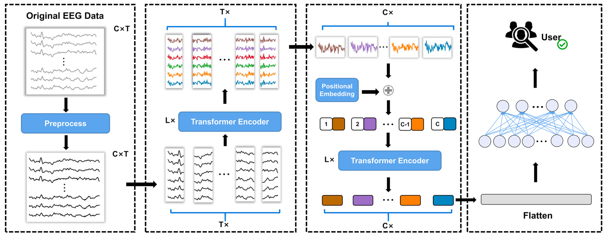

# EEG-temporal-spatial-transformer-for-person-identification
[Unofficial] implementation of the paper EEG temporal-spatial transformer for person identification.
 *Du, Yang, Yongling Xu, Xiaoan Wang, Li Liu, and Pengcheng Ma. "EEG temporal–spatial transformer for person identification." Scientific Reports 12 (2022): 14378. https://doi.org/10.1038/s41598-022-18502-3.*

The EEG Temporal-Spatial Transformer model is dedicated to the task of person identification based on EEG signals. It leverages a transformer-based neural network to extract temporal and spatial features from EEG signals, ensuring high accuracy even across different states of the individuals.
  
<b>At the time of publication, this model achieved SOTA with an accuracy of up to 100% on the PhysioNet EEG Dataset.</b>

   

# Architecture

 

T - size of the sampling points
 
C - number of EEG channels

The preprocessing consists of:
- 0.5-42 Hz bandpass filtering
- Independent component analysis (ICA) 
- Standardization with z-score to obtain a mean of 0 and a standard deviation of 1

 

The EEG Temporal-Spatial Transformer architecture consists of two main parts: the Temporal Transformer Encoder and the Spatial Transformer Encoder.
 
The temporal encoder captures long-range dependencies in the time domain while the spatial encoder captures dependencies across EEG channels. The final layer is a fully connected layer for classification output.

   

# Results

<small>

| Method                       | EO              | EC              | PHY             | IMA             |
|------------------------------|-----------------|-----------------|-----------------|-----------------|
| FuzzEn + SVM    | 84.14 ± 0.83    | 83.73 ± 0.71    | 77.93 ± 0.59    | 80.84 ± 0.18    |
| Raw + CNN       | 96.89 ± 0.77    | 67.43 ± 47.36   | 97.96 ± 1.55    | 97.42 ± 0.83    |
| Graph + Mahalanobis distance | 99.07 ± 0.19    | 97.56 ± 0.24    | 99.74 ± 0.13    | 99.61 ± 0.11    |
| PLV + GCNN      | 99.97 ± 0.03    | 99.88 ± 0.03    | **99.99 ± 0.02**| **100.00 ± 0.00**|
| Lite transformer| 83.77 ± 17.39   | 85.57 ± 22.24   | 99.76 ± 0.01    | 99.65 ± 0.08    |
| EA-transformer  | 98.45 ± 1.17    | 98.19 ± 3.14    | 99.93 ± 0.00    | 99.90 ± 0.01    |
| **Ours**                     | **100.00 ± 0.00** | **99.96 ± 0.06** | 99.97 ± 0.01    | **100.00 ± 0.00**|

</small>
Results within each human state are given as average ± std  
Source: original publication.

